# CrimeX Cameroon — UML Diagram Specifications

## 1. Document purpose

This document specifies the UML model of the CrimeX Cameroon community-safety platform. It is based on the current React/Vite client, Express API, MongoDB/Mongoose models, continuous emergency WebSocket recording, and DigiPay Mobile Money integration.

All diagrams use PlantUML. Copy any `plantuml` code block into a PlantUML renderer or use a PlantUML extension in an IDE.

## 2. Scope and conventions

### 2.1 System scope

CrimeX supports:

- bilingual citizen access in English and French;
- authenticated and anonymous incident reporting;
- evidence upload and confidential report tracking;
- operator triage, assignment, dispatch, and resolution;
- emergency alerts with location and continuous private video recording;
- community posts and moderation;
- verified agency administration;
- notifications, SMS/USSD/WhatsApp channel events, and browser push;
- optional DigiPay contributions through MTN or Orange Cameroon numbers;
- privacy requests, auditing, retention, and legal holds.

### 2.2 Main actors

| Actor | Responsibility |
|---|---|
| Visitor | Views public information, submits an anonymous report, and tracks it with a recovery code. |
| Citizen | Manages a profile, reports incidents, activates emergencies, tracks cases, and makes optional contributions. |
| Dispatcher | Triages reports, assigns responders/agencies, manages emergencies, and sends notifications. |
| Responder | Police, gendarmerie, fire, medical, council, or NGO user who handles assigned cases. |
| Administrator | Manages users, agencies, moderation, payments, payouts, and system oversight. |
| Trusted Contact | Receives an SMS when an authenticated citizen activates an emergency. |
| DigiPay | External payment gateway for pay-ins, transaction status, balance, and payouts. |
| SMS/Push Service | Delivers trusted-contact SMS and targeted browser notifications. |

### 2.3 Matched behavioural diagram sets

The same three workflows are used for the specific use-case, sequence, activity, and communication diagrams.

| Set | Specific use case | Sequence | Activity | Communication |
|---|---|---|---|---|
| A | Submit and process incident report | SQ-01 | ACT-01 | COM-01 |
| B | Activate emergency and record video | SQ-02 | ACT-02 | COM-02 |
| C | Make optional Mobile Money contribution | SQ-03 | ACT-03 | COM-03 |

---

## 3. General use-case diagram

### UC-GEN-01 — CrimeX system overview

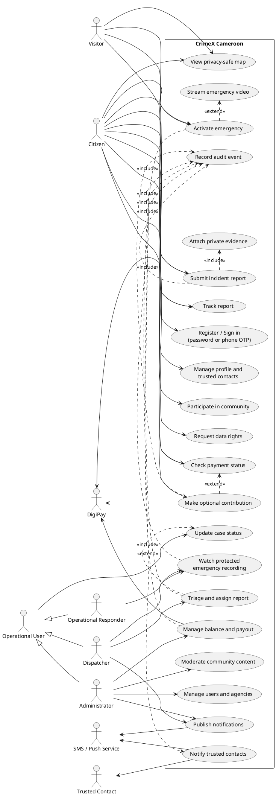

---

## 4. Specific use-case diagrams and specifications

## 4.1 UC-01 — Submit and process an incident report

### Specification

| Field | Description |
|---|---|
| Primary actor | Citizen or Visitor |
| Supporting actors | Dispatcher, Responder, verified Agency, Push Service |
| Goal | Create a confidential incident record and progress it to a final operational decision. |
| Trigger | The reporter selects “Report an incident.” |
| Preconditions | The platform is available; category, description, and location can be supplied. Authentication is optional. |
| Success postcondition | A report with a Cameroon reference, timeline, retention date, and initial `received` status is stored. |
| Anonymous postcondition | The reporter receives a one-time recovery code; only its hash is stored. |
| Failure postcondition | No incomplete report is stored; validation or duplicate-offline-submission error is returned. |

### Main success flow

1. Reporter opens the report form.
2. Reporter chooses authenticated or anonymous reporting.
3. Reporter enters category, severity, description, landmark/address, jurisdiction, and optional coordinates.
4. Reporter optionally attaches up to six evidence files.
5. The system validates required fields and evidence constraints.
6. For anonymous reporting, the system generates or validates a recovery code and stores only its hash.
7. The system stores the report with status `received` and a timeline entry.
8. The system creates a jurisdiction notification and audit entry.
9. The system returns the report reference and, when anonymous, the recovery code.
10. A dispatcher triages the report and assigns a verified agency or responder.
11. The assigned responder receives an in-app/browser notification.
12. Authorized staff update the report until it is resolved or rejected.

### Alternate and exception flows

- **A1 — Offline submission:** the client stores a submission locally and later sends it with a unique `clientSubmissionId`.
- **A2 — Duplicate offline submission:** the API returns HTTP 409 and does not create another report.
- **A3 — Invalid required data:** the API returns HTTP 400.
- **A4 — Anonymous tracking:** the reporter supplies the reference and recovery code; the API compares its hash.
- **A5 — Invalid recovery code:** access is denied without revealing report contents.
- **A6 — Agency not verified:** assignment is rejected.
- **A7 — Sensitive report:** it remains excluded from the public map.

### Diagram

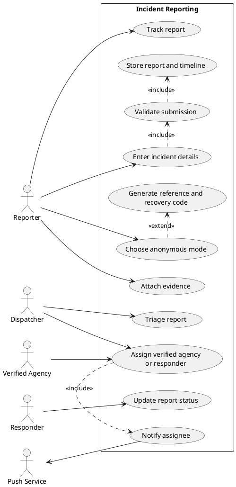

## 4.2 UC-02 — Activate an emergency and record video

### Specification

| Field | Description |
|---|---|
| Primary actor | Citizen or Visitor |
| Supporting actors | Dispatcher/Responder, Trusted Contact, SMS Service |
| Goal | Store an emergency alert immediately and, with consent, transfer one continuous private recording. |
| Trigger | The user activates the emergency control and confirms recording/location permissions. |
| Preconditions | Browser camera support is available for video; an alert may still be created without a recording. |
| Success postcondition | The emergency is queued; a completed recording is stored privately; operators can watch it after authorization. |
| Guest postcondition | A recovery code is returned and required for the recording stream. |
| Failure postcondition | An interrupted or rejected partial file is removed and no incomplete recording remains attached. |

### Main success flow

1. User activates the emergency control.
2. Client requests camera/microphone and location permissions.
3. Client creates a unique recording session ID.
4. API stores an emergency with `queued` status and a retention date.
5. For a guest, the API generates a recovery code; for a citizen, the authenticated user owns the alert.
6. The system attempts SMS notifications to enabled trusted contacts.
7. The system creates a dispatcher notification.
8. Client opens the emergency WebSocket only for this recording session.
9. Client authenticates the socket using the bearer token or recovery code.
10. Client transfers MediaRecorder bytes continuously.
11. User presses Stop.
12. Client stops tracks and sends `complete` after buffered bytes drain.
13. Server finalizes the private recording and updates its size/completion time.
14. An authorized operator opens the emergency log and watches the recording through protected HTTP range requests.

### Alternate and exception flows

- **B1 — Permission denied:** create the alert if possible, show official Cameroon emergency numbers, and omit video/location not consented to.
- **B2 — Invalid stream authentication:** close the socket and delete temporary data.
- **B3 — Recording exceeds configured limit:** reject the stream and delete the partial file.
- **B4 — Network disconnect before completion:** clean up the partial recording.
- **B5 — Duplicate recording:** reject a second stream for the same emergency.
- **B6 — Invalid playback authorization:** return HTTP 403.
- **B7 — Seeking:** return HTTP 206 with the requested byte range.

### Diagram

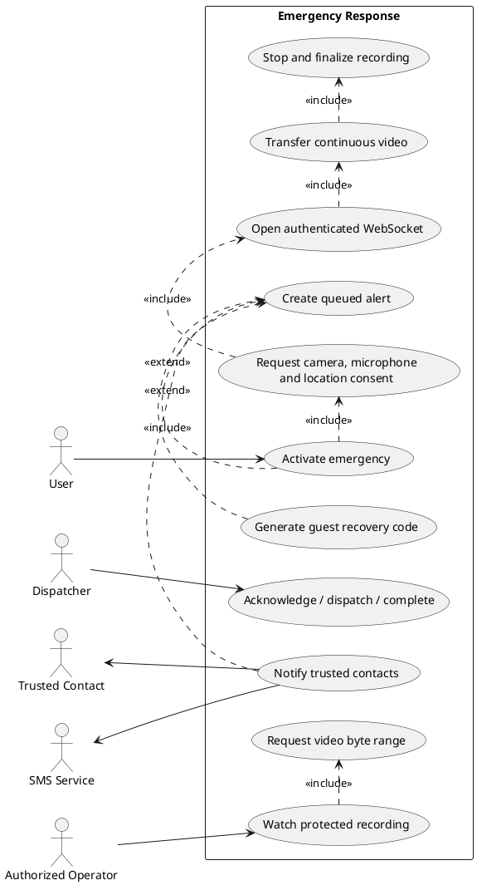

## 4.3 UC-03 — Make an optional Mobile Money contribution

### Specification

| Field | Description |
|---|---|
| Primary actor | Authenticated Citizen |
| Supporting actors | DigiPay, MTN Mobile Money or Orange Money, Administrator |
| Goal | Make an optional donation or organization subscription payment in XAF. |
| Trigger | Citizen selects a contribution purpose and enters payment details. |
| Preconditions | User is authenticated; payment is not required for incident reporting. |
| Success postcondition | A payment record contains its CrimeX reference, DigiPay transaction ID, amounts, and final status. |
| Failure postcondition | Validation failure prevents gateway initiation; gateway failure is retained as a failed transaction when applicable. |

### Main success flow

1. Citizen chooses `donation` or `organization_subscription`.
2. Citizen selects MTN or Orange and enters a Cameroon mobile number and amount.
3. API normalizes the number to `2376XXXXXXXX`.
4. API validates provider, purpose, phone, and minimum amount of 100 XAF.
5. API stores a pending payment with a `PAY-...` reference.
6. API asks DigiPay to initiate a pay-in.
7. DigiPay sends a Mobile Money approval prompt to the customer.
8. API stores the transaction ID, gateway status, base amount, charged amount, and commission.
9. Citizen can request a transaction-status refresh.
10. DigiPay or the secured webhook supplies the final status.
11. The system displays `success`, `failed`, `cancelled`, or another valid state.

### Alternate and exception flows

- **C1 — Invalid phone:** reject any number not matching Cameroon `2376XXXXXXXX` after normalization.
- **C2 — Amount below 100 XAF:** return HTTP 400.
- **C3 — Unsupported provider or purpose:** return HTTP 400.
- **C4 — User declines or times out:** status becomes `failed` or `cancelled` according to DigiPay.
- **C5 — Development mode:** DigiPay service may mark the transaction as simulated.
- **C6 — Invalid webhook secret:** return HTTP 401 without changing the payment.
- **C7 — Admin settlement:** an administrator may check merchant balance or request a payout to a Cameroon number.

### Diagram

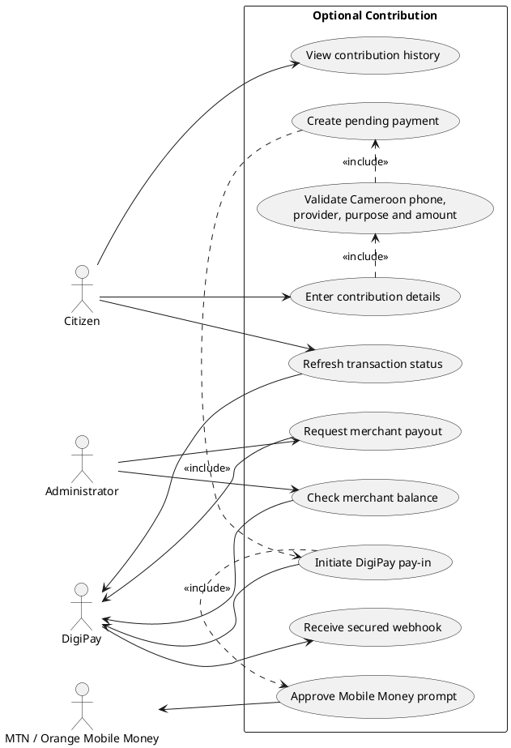

---

## 5. Sequence diagrams

## 5.1 SQ-01 — Submit and process incident report

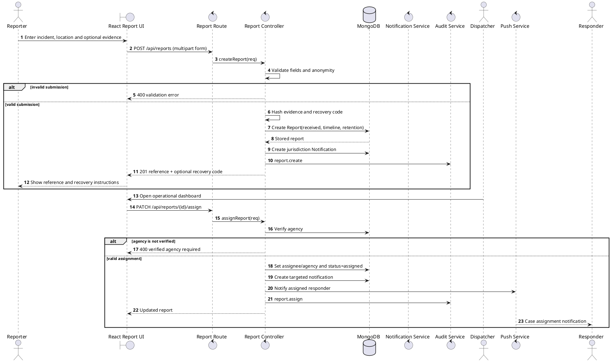

## 5.2 SQ-02 — Activate emergency and record/watch video

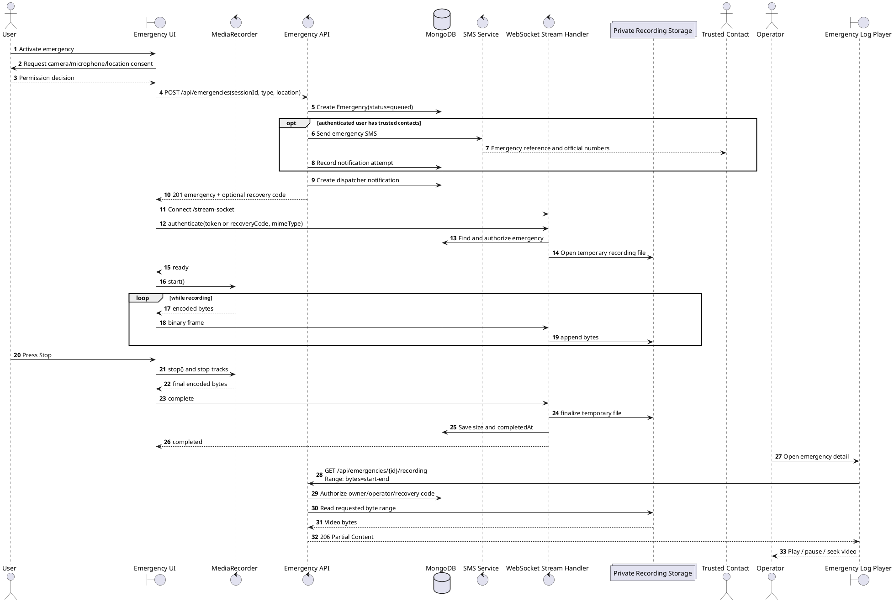

## 5.3 SQ-03 — Make optional Mobile Money contribution

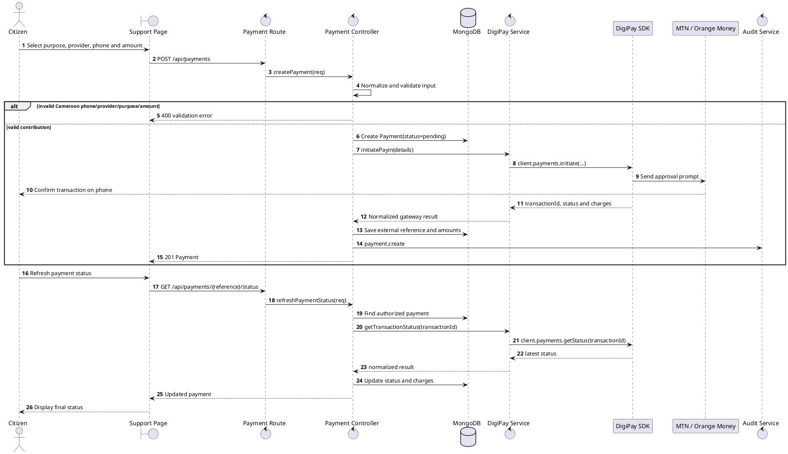

---

## 6. Activity diagrams

## 6.1 ACT-01 — Submit and process incident report

Corresponds to **UC-01** and **SQ-01**.

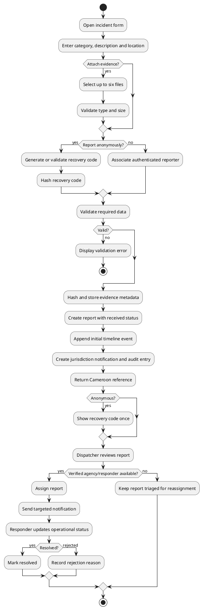

## 6.2 ACT-02 — Activate emergency and record/watch video

Corresponds to **UC-02** and **SQ-02**.

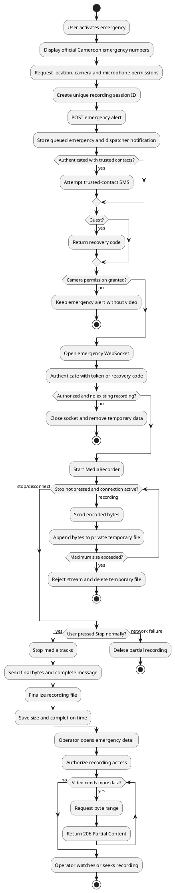

## 6.3 ACT-03 — Make optional Mobile Money contribution

Corresponds to **UC-03** and **SQ-03**.

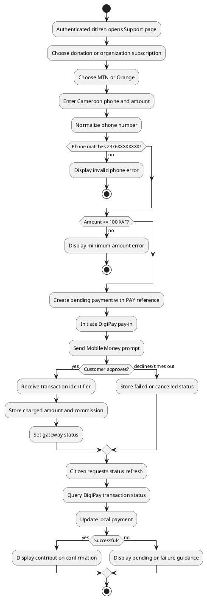

---

## 7. Communication diagrams

Communication diagrams use the same participants and numbered messages as their corresponding sequence diagrams.

## 7.1 COM-01 — Incident report communication

Corresponds to **SQ-01** and **ACT-01**.

```plantuml
@startuml
left to right direction
skinparam linetype ortho
object Reporter
object "React Report UI" as UI
object "Report Route" as Route
object "Report Controller" as Controller
database MongoDB as DB
object "Notification/Push Service" as Notify
object Dispatcher
object Responder

Reporter --> UI : 1: enterIncident(details, evidence)
UI --> Route : 2: POST /api/reports
Route --> Controller : 2.1: createReport(req)
Controller --> Controller : 2.2: validateAndHash()
Controller --> DB : 2.3: createReport(received)
Controller --> DB : 2.4: createJurisdictionNotification()
Controller --> DB : 2.5: createAuditLog()
Controller --> UI : 2.6: reference + recoveryCode?
UI --> Reporter : 3: showSubmissionResult()
Dispatcher --> UI : 4: chooseAssignee()
UI --> Route : 4.1: PATCH /reports/{id}/assign
Route --> Controller : 4.2: assignReport(req)
Controller --> DB : 4.3: verifyAgencyAndUpdateReport()
Controller --> Notify : 4.4: notifyAssignee()
Notify --> Responder : 4.5: caseAssigned(reference)
@enduml
```

## 7.2 COM-02 — Emergency recording communication

Corresponds to **SQ-02** and **ACT-02**.

```plantuml
@startuml
left to right direction
skinparam linetype ortho
object User
object "Emergency UI" as UI
object MediaRecorder as Media
object "Emergency API" as API
object "WebSocket Handler" as WS
database MongoDB as DB
collections "Private Storage" as Storage
object "SMS Service" as SMS
object "Video Player" as Player
object Operator

User --> UI : 1: activateEmergency()
UI --> User : 1.1: requestPermissions()
UI --> API : 2: createEmergency(session, location)
API --> DB : 2.1: saveQueuedEmergency()
API --> SMS : 2.2: notifyTrustedContacts()
API --> UI : 2.3: emergency + recoveryCode?
UI --> WS : 3: connectAndAuthenticate()
WS --> DB : 3.1: authorizeSession()
WS --> Storage : 3.2: openTemporaryFile()
WS --> UI : 3.3: ready
UI --> Media : 4: start()
Media --> UI : 4.1*: encodedBytes
UI --> WS : 4.2*: binaryFrame
WS --> Storage : 4.3*: appendBytes
User --> UI : 5: stop()
UI --> Media : 5.1: stopTracks()
UI --> WS : 5.2: complete
WS --> Storage : 5.3: finalizeFile()
WS --> DB : 5.4: saveRecordingMetadata()
Operator --> Player : 6: openRecording()
Player --> API : 6.1*: GET recording + Range
API --> DB : 6.2: authorizeOperator()
API --> Storage : 6.3: readByteRange()
API --> Player : 6.4: 206 Partial Content
@enduml
```

## 7.3 COM-03 — DigiPay contribution communication

Corresponds to **SQ-03** and **ACT-03**.

```plantuml
@startuml
left to right direction
skinparam linetype ortho
object Citizen
object "Support Page" as UI
object "Payment Route" as Route
object "Payment Controller" as Controller
database MongoDB as DB
object "DigiPay Service" as Service
object "DigiPay SDK" as SDK
object "MTN/Orange Money" as MoMo

Citizen --> UI : 1: enterContribution()
UI --> Route : 2: POST /api/payments
Route --> Controller : 2.1: createPayment(req)
Controller --> Controller : 2.2: normalizeAndValidate()
Controller --> DB : 2.3: createPendingPayment()
Controller --> Service : 2.4: initiatePayin()
Service --> SDK : 2.5: payments.initiate()
SDK --> MoMo : 2.6: requestCustomerApproval()
MoMo --> Citizen : 2.7: approvalPrompt
SDK --> Service : 2.8: transactionResult
Service --> Controller : 2.9: normalizedResult
Controller --> DB : 2.10: saveGatewayFields()
Controller --> UI : 2.11: payment
Citizen --> UI : 3: refreshStatus()
UI --> Route : 3.1: GET /payments/{reference}/status
Route --> Controller : 3.2: refreshPaymentStatus()
Controller --> Service : 3.3: getTransactionStatus()
Service --> SDK : 3.4: payments.getStatus()
SDK --> Service : 3.5: latestStatus
Controller --> DB : 3.6: updatePayment()
Controller --> UI : 3.7: updatedPayment
@enduml
```

---

## 8. State-machine diagrams

## 8.1 STM-01 — Incident report lifecycle

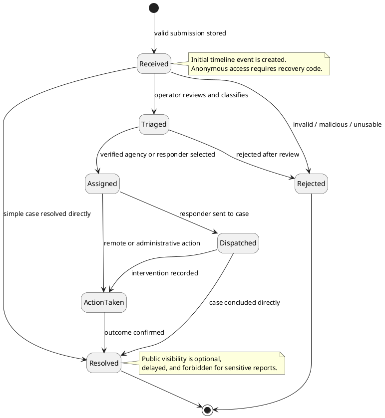

## 8.2 STM-02 — Emergency lifecycle

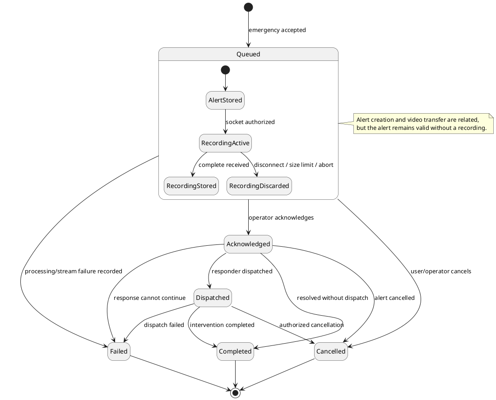

---

## 9. Class diagram

The class diagram focuses on persistent domain models and their principal relationships. Embedded value objects are shown separately where they clarify cardinality.

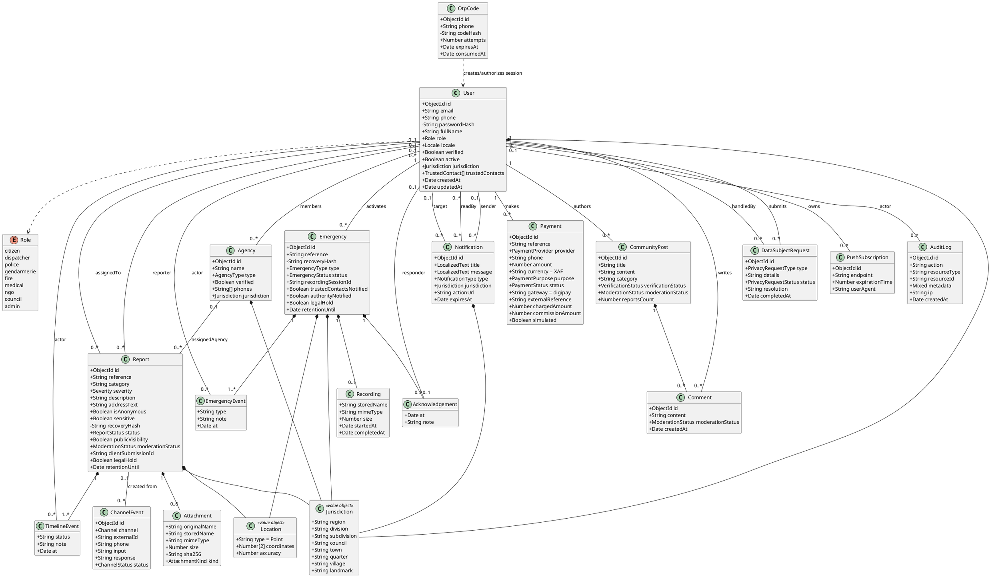

### Key enumerations represented by the implementation

| Enumeration | Values |
|---|---|
| `ReportStatus` | `received`, `triaged`, `assigned`, `dispatched`, `action_taken`, `resolved`, `rejected` |
| `EmergencyStatus` | `queued`, `acknowledged`, `dispatched`, `completed`, `failed`, `cancelled` |
| `PaymentStatus` | `pending`, `success`, `failed`, `refunded`, `cancelled` |
| `PaymentProvider` | `mtn`, `orange` |
| `PaymentPurpose` | `donation`, `organization_subscription` |
| `EmergencyType` | `police`, `gendarmerie`, `fire`, `medical`, `gbv`, `general`, `panic_button` |
| `Severity` | `low`, `medium`, `high`, `critical` |
| `ModerationStatus` | `pending/verified/rejected` for reports; `visible/flagged/removed` for community content |
| `Channel` | `sms`, `ussd`, `whatsapp` |

---

## 10. Traceability to implementation

| UML element | Main implementation files |
|---|---|
| Authentication and users | `server/models/User.js`, `server/controllers/userController.js`, `server/routes/userRoutes.js` |
| Incident reports | `server/models/Report.js`, `server/controllers/reportController.js`, `server/routes/reportRoutes.js` |
| Emergency/video | `server/models/Emergency.js`, `server/controllers/emergencyController.js`, `server/routes/emergencyRoutes.js`, `src/components/emergency/EmergencyButton.tsx`, `src/components/dashboard/EmergencyLogsViewer.tsx` |
| DigiPay contribution | `server/models/Payment.js`, `server/controllers/paymentController.js`, `server/services/digiPayService.js`, `server/routes/paymentRoutes.js`, `src/pages/SupportPage.tsx` |
| Agencies | `server/models/Agency.js`, `server/controllers/agencyController.js`, `server/routes/agencyRoutes.js` |
| Notifications and push | `server/models/Notification.js`, `server/models/PushSubscription.js`, related controllers/routes/services |
| Community/moderation | `server/models/CommunityPost.js`, related controller and route |
| Privacy and audit | `server/models/DataSubjectRequest.js`, `server/models/AuditLog.js`, related controllers/routes |

## 11. Diagram inventory checklist

- [x] 1 general use-case diagram
- [x] 3 specific use-case diagrams with textual specifications
- [x] 3 sequence diagrams
- [x] 3 corresponding activity diagrams
- [x] 2 state-machine diagrams
- [x] 3 communication diagrams corresponding to the sequence diagrams
- [x] 1 domain class diagram
